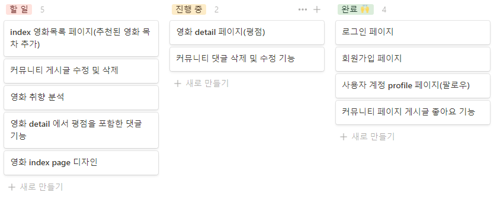

# 관통 프로젝트

### 광주 3반 최수한, 하지애

> SSAFY pjt-Final
>
> DB 영화 추천 서비스 및 커뮤니티 사이트 "FavMov"


------

## 목차

1. [팀원 정보 및 업무 분담 내역](#1-팀원-정보-및-업무-분담-내역)
   - 팀명
   - 팀원 정보 | 업무 분담 내역
2. [사이트명 & 배포 서버 URL](#2-사이트명-배포-서버-url)

   - 사이트명

   - 배포 서버 URL

3. [개발 환경](#3-개발환경)

   - 언어
   - 도구
   - 아키텍처
4. [목표 서비스 구현 및 실제 구현 정도](#4-목표-서비스-구현-및-실제-구현-정도)

   - 목표 설정
   - Design Thinking
   - 목표 서비스 구현 및 실제 구현 정도 비교
5. [데이터베이스 모델링 (ERD)](#5-데이터베이스-모델링-ERD)
6. [개발과정](#6-개발과정)

   - 날짜별 진행상황
7. [필수 기능](#7-필수-기능)
8. [느낀 점](#8-느낀-점)


------

## 1. 팀원 정보 및 업무 분담 내역

1. 팀명
   - Choiai
2. 팀원 정보 | 업무 분담 내역
   - 최수한 (팀장)
     - 백엔드
   - 하지애
     - 프론트엔드


------

## 2. 사이트명 & 배포 서버 URL

1. 사이트명 - FavMov 
   - FavMov란 Favorite Movie의 약자.   
2. 배포 서버 URL
   - https://favmov.pythonanywhere.com/movies/


------

## 3. 개발환경

1. 언어
   - Python 3.9.6
   - Django 3.2.3
   - Node.js LTS
2. 도구
   - VSCpde
3. 아키텍쳐
   - Django & Vanila JS


------

## 4. 목표 서비스 구현 및 실제 구현 정도

1. 목표 설정
   - 영화 평점, 선호&비선호하는 장르, 좋아하는 영화를 기반으로 한 영화추천 서비스 구성
   - 커뮤니티 서비스 구성
   - HTML, CSS, JavaScript, Django, REST API, DataBase 등을 활용한 실제 서비스 설계
   - 사이트 배포

2. Design Thinking

   - 페르소나1 (타겟)
     - 영화 커뮤니티에서 활동하고 싶은 20대 학생 A씨  
     - 공포, 전쟁 영화를 싫어해서 절대 관련 포스터도 보기 싫어함
     - 좋아하는 영화 장르가 뚜렷하고 좋아하는 영화와 비슷한 영화들을 추천받고 싶음
   - 페르소나2
     - 평소 평점 위주로만 추천하는 영화 사이트들에서 싫어하는 장르여도 높은 평점인 영화를 추천 받는게 불만인 직장인 B씨
     - 직접 평점을 매기고 영화를 추천받고 싶어함

3. 목표 서비스 구현 및 실제 구현 정도 비교

   - 요구사항

   |     분야      |                         목표 서비스                          | 실제구현 |
   | :-----------: | :----------------------------------------------------------: | :------: |
   |   관리자 뷰   |  관리자 권한의 유저만 영화 등록/수정/삭제 권한을 가집니다.   |    ✔     |
   |               |       관리자 권한의 유저만 유저 관리 권한을 가집니다.        |    ✔     |
   |               | 장고에서 기본적으로 제공하는 admin 기능을 이용하여 구현합니다. |    ✔     |
   |   영화정보    | 영화정보는 Database Seeding을 활용하여 최소 50개 이상의 데이터가 존재하도록 구성해야 합니다. |    ✔     |
   |               | 모든 로그인 된 유저는 영화에 대한 평정 등록.수정.삭제 등을 할 수 있어야 합니다. |    ✔     |
   | 추천 알고리즘 | 평점을 등록한 유저는 해당 정보를 기반으로 영화를 추천받을 수 있어야 합니다. |    ✔     |
   |               | 추천 알고리즘의 지정된 형식은 없으나, 사용자는 반드시 최소 1개 이상의 방식으로 영화를 추천 받을 수 있어야 합니다. |    ✔     |
   |               | 추천 방식은 각 팀별로 자유롭게 선택할 수 있으며 어떠한 방식으로 추천 시스템을 구성했는지 설명할 수 있어야 합니다. |    ✔     |
   |   커뮤니티    | 영화 정보와 관련된 대화를 할 수 있는 커뮤니티 기능을 구현해야 합니다. |    ✔     |
   |               | 로그인한 사용자만 글을 조회/생성할 수 있으며 작성자 본인만 글을 수정/삭제 할 수 있습니다. |    ✔     |
   |               | 사용자는 작성된 게시글에 댓글을 작성할 수 있어야 하며, 작성자 본인만 댓글을 삭제할 수 있습니다. |    ✔     |
   |               | 각 게시글 및 댓글은 생성 및 수정 시각 정보가 포함되어야 합니다. |    ✔     |
   |     기타      |      최소한 5개 이상의 URL 및 페이지를 구성해야 합니다.      |    ✔     |
   |               | HTTP Method와 상태 코드는 상황에 맞게 적절하게 반환되어야 하며, 필요에 따라 메시지 프레임워크 등을 사용하여 에러 페이지를 구성해야 합니다. |    ✔     |
   |               | 필요한 경우 Ajax를 활용한 비동기 요청을 통해 사용자 경험을 향상시켜야 합니다. |    ✔     |

   - 목표 서비스
   
   |                         목표 서비스                          | 실제 구현 |
   | :----------------------------------------------------------: | :-------: |
   | '내 프로필' 메뉴에 My FavMov(선호하는 장르, 비선호하는 장르, 좋아하는 영화) 표시(다중 선택 가능) |     ✔     |
   |  My FavMov와 사이트 내 평점을 기반으로 한 영화 추천 서비스   |     ✔     |
   |           Community 내 좋아요, rank(별 표시) 기능            |     ✔     |
   
   

------

## 5. 데이터베이스 모델링 (ERD)


------

## 6. 개발과정

###  11.17

#### 일정관리


#### ERD


#### UI

- INDEX

  

  

- My Profile

  

- Movie

  

- Community

  

- Detail

  

- New Reriew (CREATE)

  


#### 진행 현황



할일을 기능별로 구분하고, 할일, 진행 중, 완료로 구분하였습니다.

화면 UI/UX 초안 설계를 마쳤고, ERD는 작성 중에 있습니다.

현재 로그인 및 회원가입 기능 구현 완료, ajax 통한 사용자 profile 팔로우 및 커뮤니티 게시글 좋아요 기능을 구현하였습니다.

영화 detail 페이지에 댓글 작성 기능 및 커뮤니티 게시글 과 댓글 작성 기능은 구현하였고, 영화 detail 페이지 댓글 삭제 기능 및 커뮤니티 게시글과 댓글 삭제 및 수정 기능을 구현 중에 있습니다.


### 11.18

#### ERD


#### 진행 현황


ERD는 작성하고 있으며, 추후에 계속 수정할 예정입니다.

기능 구현 완료한 항목들에 날짜들을 추가하였고,  community detail에 랭크를 별표로 띄우는 기능을 구현중에 있습니다. 

완료된 기능은 커뮤니티 댓글 삭제 기능과 커뮤니티 게시글 수정 및 삭제 기능이 있습니다.

비로그인 상황에서 네비 기능을 추가하였고, 좋아요를 누르면 로그인 페이지로 이동하게 구현하였습니다.

불필요한 글 번호는 community index 페이지와 영화 detail 페이지에서 나오지 않도록 수정하였고, 

영화 detail 댓글에 랭크를 별표와 같이 등록할 수 있도록 구현하였습니다.


### 11.19

영화 Detail 댓글에 rank 반개 기능을 추가해서 좀 더 정확한 rank를 제공할 수 있도록 했습니다.

Community 게시글이 숫자로 rank가 표시되는 부분을 별로 표시되게 바꿔줬습니다. 

영화 Community detail에 좋아요 기능을 추가했습니다.


### 11.21

프로필에 취향(화면상에서는 My FavMov)을 추가했습니다.

취향 부분에 업데이트 및 삭제 기능을 추가하고 취향을 한 번에 다중 선택할 수 있도록 구현했습니다.


### 11.22

홈페이지에 디자인(부트스트랩을 통하여 Navbar, 메인화면(movies:index)에 Carousel, Card 형식 추가)을 넣었습니다.

Community에 쓰여진 글이 없을 경우 글 없음 표시를 추가했습니다.

'https://favmov.pythonanywhere.com/movies/' 위 주소로 배포하였습니다.


### 11.23

홈페이지의 버튼들과 요소 간격 등을 조정해 홈페이지를 꾸몄습니다.

현재 메인페이지에는 TMDB 사이트들이 연결되어 있지만 이는 배포 시도 겸 앞으로 추천 영화 서비스를 구현하기 전 틀을 잡아 놓은 것입니다.

지금은 TMDB에 연결되어 있지만 영화추천 서비스가 구현되는 대로 지금의 자리에 추천 영화들의 포스터와 정보들이 들어갈 예정입니다.  

영화 추천 서비스는 선택한 선호 장르, 비선호 장르(두 부분 다 프로필에서 선택)와 홈페이지에서 매겨진 rank를 바탕으로 제공될 계획이고 현재 구현 중입니다.


### 11.24

영화추천 서비스에 평점까지 고려하도록 업데이트했고 TMDB 사이트가 아닌 일반 목록 평점으로 출력하도록 조정했습니다. 현재 수정사항까지 배포 완료 했습니다.


### 11.25

"내 프로필" 안 "My Favmov" 좋아하는 영화 Card 형식으로 나열되게 업데이트했습니다. 제목이 긴  경우 Card가 밀리는 문제점이 있었지만 첫째줄을 넘어가면 생략표시를 해주며 해결했습니다. 

메인페이지 취향에 따른 영화추천도 카드 형식으로 수정해줬습니다.


------

## 7. 필수 기능

### Movies Homepage

- 취향에 따른 영화 추천

  - "내 프로필"의 "My FavMov" 에 등록된 선호하는 장르, 비선호하는 장르, 좋아하는 영화 그리고 사이트 내 매겨진 평점을 기반으로 영화추천 서비스 제공 

  ```
  ```

  

### Signup & Login 

- 비로그인 상태로 Community에 좋아요를 눌렀을 시 Login page로 연결
- 비로그인 상태로 Movies Detail page에서 [댓글을 작성하려면 로그인하세요.] 클릭시 Login page로 연결


### Movies Detail

- 댓글 기능에 rank 평점 기능 추가
- 평점이 없을 경우는 DB 평점이 노출
- 평점이 1개 이상 등록될 시 사이트 내 유저들이 등록한 평균 평점이 노출

```
```


 ### 내 프로필

- 취향 변경을 통해 My FavMov(선호하는 장르, 비선호하는 장르, 좋아하는 영화) 다중 선택 가능
- My FavMov에 입력된 정보를 통해 Movies Homepage에 추천영화 서비스 제공

```
```


### Community

- 좋아요, 댓글 CRD
- Detail page에서 게시글 CRUD

```
```


### New Review

- Rank 와 함께 게시글 CREATE 


------

## 8. 느낀 점

### 최수한


### 하지애

