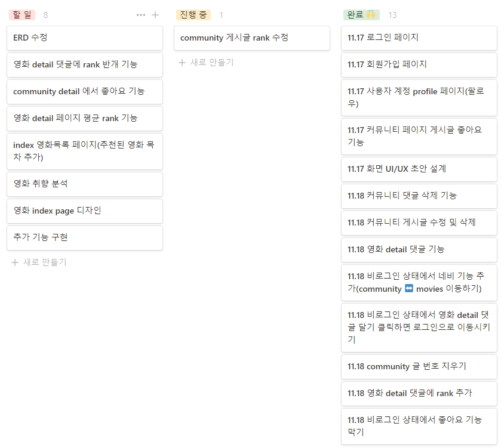

### pjt-Final 최수한 하지애

사이트 이름 Favmov

팀명 : Choiai

구성원 최수한 하지애

팀장 최수한

목차

1. 팀원 정보 및 업무 분담 내역
   1. 담당업무 | 사용언어

---

###  11.17

### 일정관리

### ERD

### UI

- INDEX

  

  

- My Profile

  

- Movie

  

- Community

  

- Detail

  

- New Reriew (CREATE)

  

### 진행 현황

할일을 기능별로 구분하고, 할일, 진행 중, 완료로 구분하였습니다.

화면 UI/UX 초안 설계를 마쳤고, ERD는 작성 중에 있습니다.

현재 로그인 및 회원가입 기능 구현 완료, ajax 통한 사용자 profile 팔로우 및 커뮤니티 게시글 좋아요 기능을 구현하였습니다.

영화 detail 페이지에 댓글 작성 기능 및 커뮤니티 게시글 과 댓글 작성 기능은 구현하였고, 영화 detail 페이지 댓글 삭제 기능 및 커뮤니티 게시글과 댓글 삭제 및 수정 기능을 구현 중에 있습니다.

---

### 11.18

### ERD

### 진행 현황

ERD는 작성하고 있으며, 추후에 계속 수정할 예정입니다.

기능 구현 완료한 항목들에 날짜들을 추가하였고,  community detail에 랭크를 별표로 띄우는 기능을 구현중에 있습니다. 

완료된 기능은 커뮤니티 댓글 삭제 기능과 커뮤니티 게시글 수정 및 삭제 기능이 있습니다.

비로그인 상황에서 네비 기능을 추가하였고, 좋아요를 누르면 로그인 페이지로 이동하게 구현하였습니다.

불필요한 글 번호는 community index 페이지와 영화 detail 페이지에서 나오지 않도록 수정하였고, 

영화 detail 댓글에 랭크를 별표와 같이 등록할 수 있도록 구현하였습니다.

---

### 11.19

영화 Detail 댓글에 rank 반개 기능을 추가해서 좀 더 정확한 rank를 제공할 수 있도록 했습니다.

Community 게시글이 숫자로 rank가 표시되는 부분을 별로 표시되게 바꿔줬습니다. 

영화 Community detail에 좋아요 기능을 추가했습니다.

------

### 11.21

프로필에 취향(화면상에서는 My FavMov)을 추가했습니다.

취향 부분에 업데이트 및 삭제 기능을 추가하고 취향을 한 번에 다중 선택할 수 있도록 구현했습니다.

------

### 11.22

홈페이지에 디자인(부트스트랩을 통하여 Navbar, 메인화면(movies:index)에 Carousel, Card 형식 추가)을 넣었습니다.

Community에 쓰여진 글이 없을 경우 글 없음 표시를 추가했습니다.

'https://favmov.pythonanywhere.com/movies/' 위 주소로 배포하였습니다.

------

### 11.23

홈페이지의 버튼들과 요소 간격 등을 조정해 홈페이지를 꾸몄습니다.

현재 메인페이지에는 TMDB 사이트들이 연결되어 있지만 이는 배포 시도 겸 앞으로 추천 영화 서비스를 구현하기 전 틀을 잡아 놓은 것입니다.

지금은 TMDB에 연결되어 있지만 영화추천 서비스가 구현되는 대로 지금의 자리에 추천 영화들의 포스터와 정보들이 들어갈 예정입니다.  

영화 추천 서비스는 선택한 선호 장르, 비선호 장르(두 부분 다 프로필에서 선택)와 홈페이지에서 매겨진 rank를 바탕으로 제공될 계획이고 현재 구현 중입니다.

